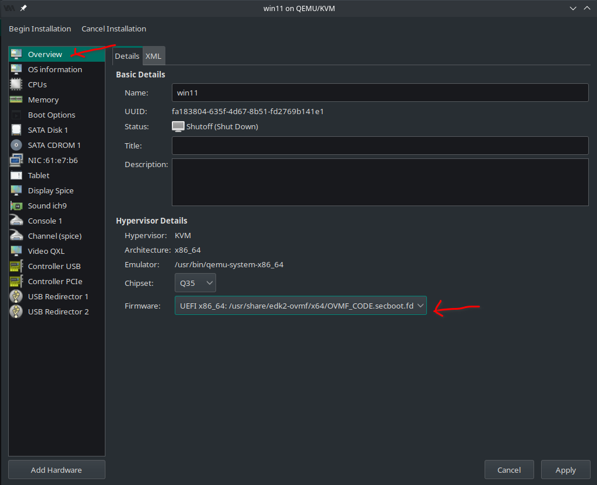
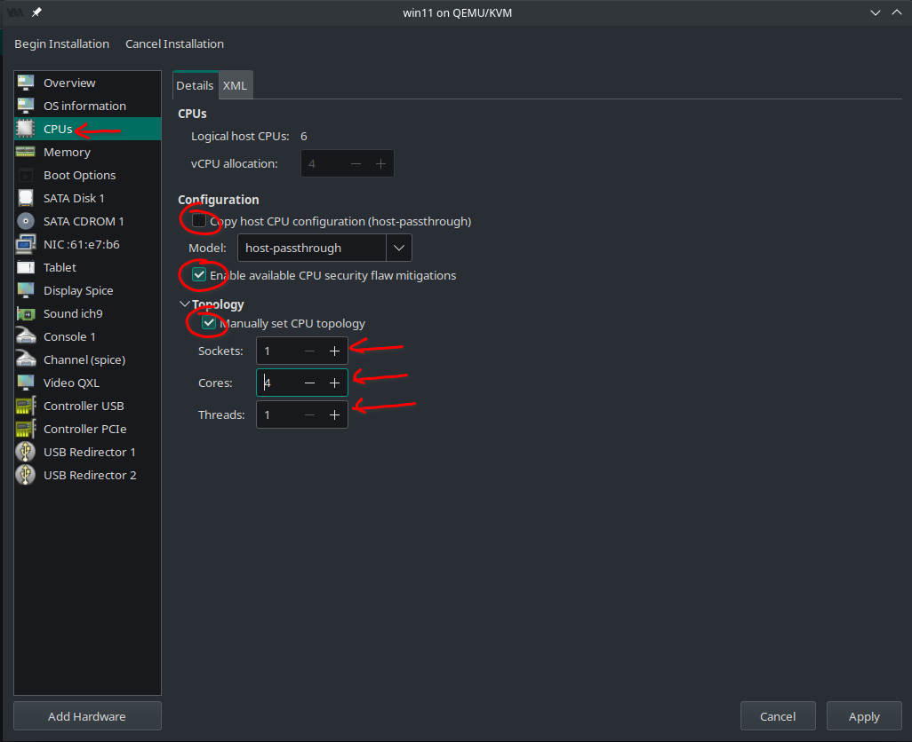
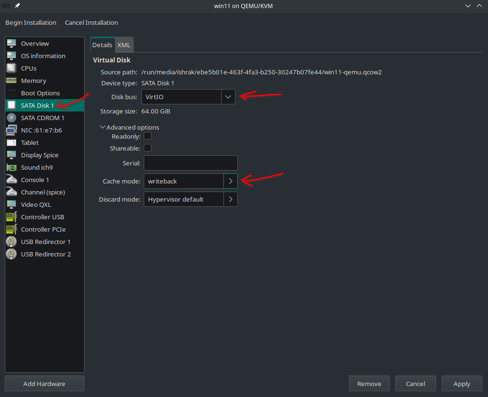
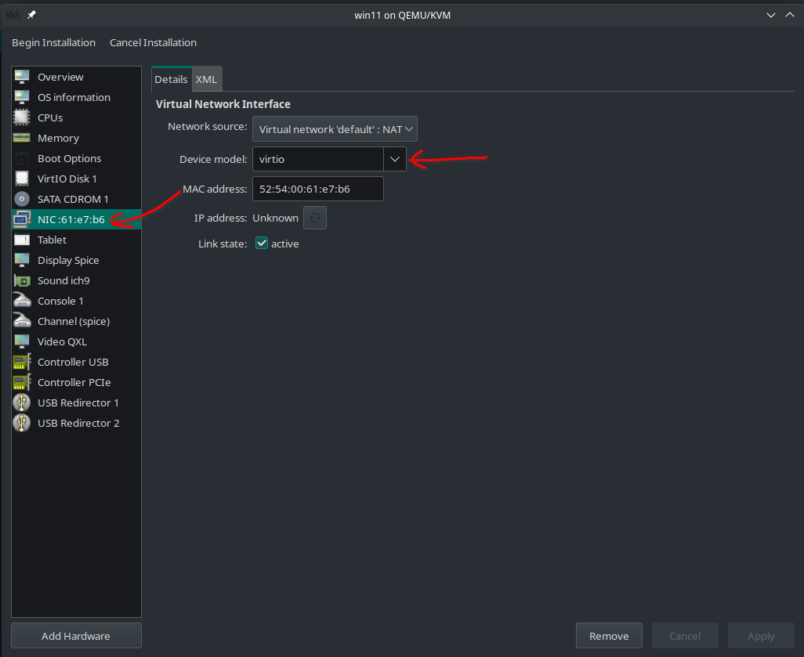
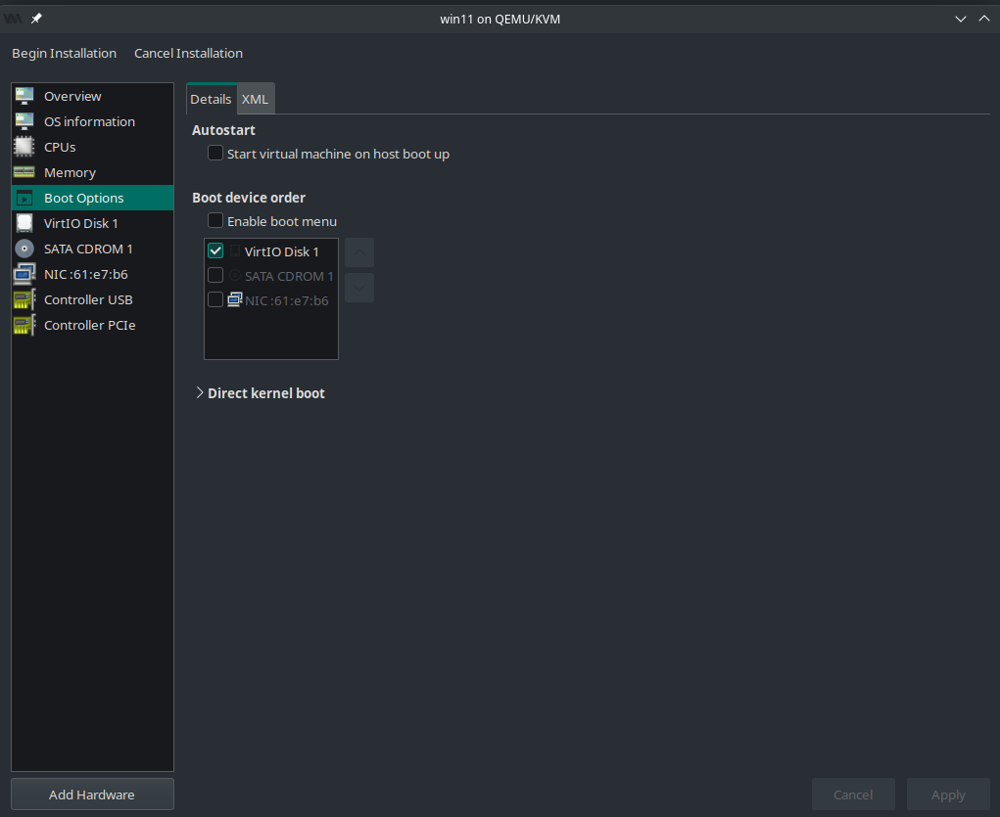
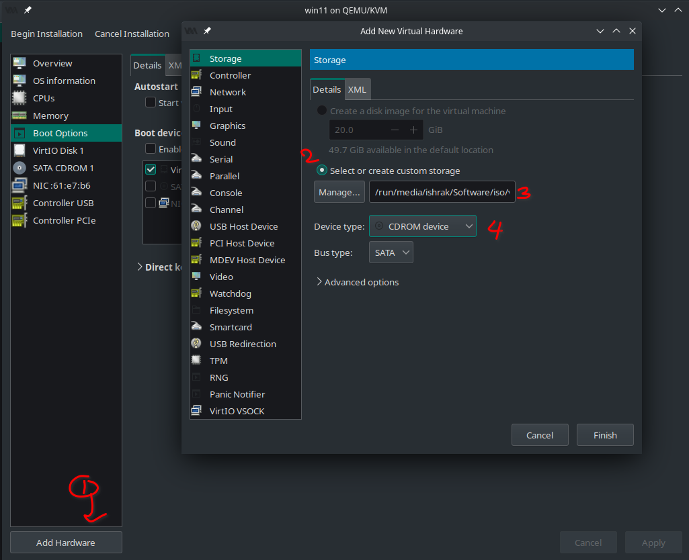
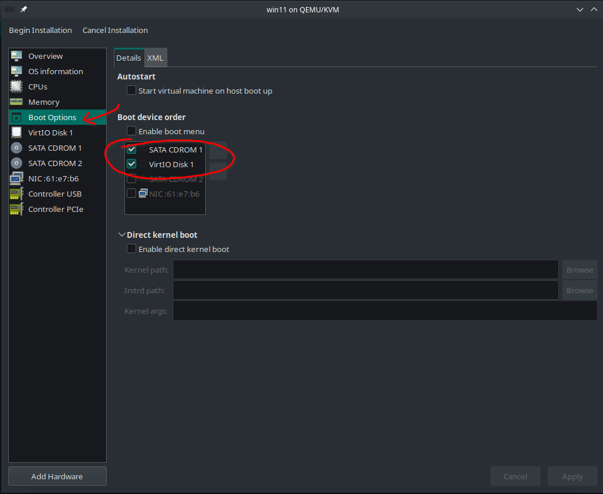
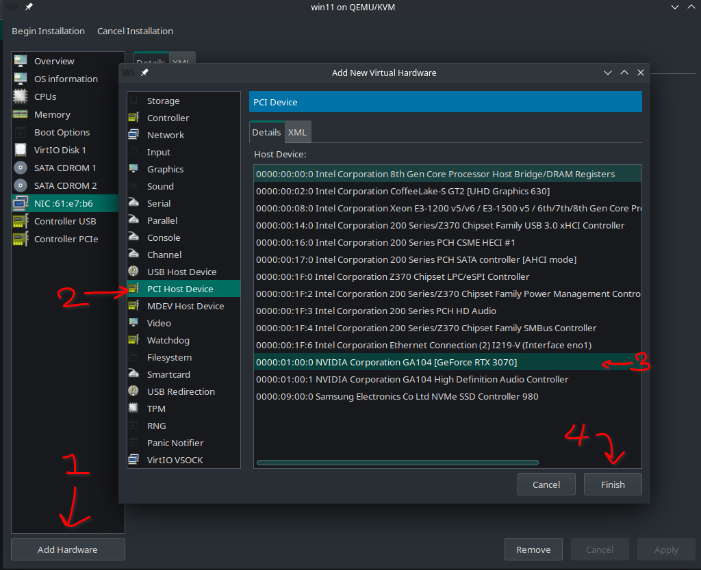
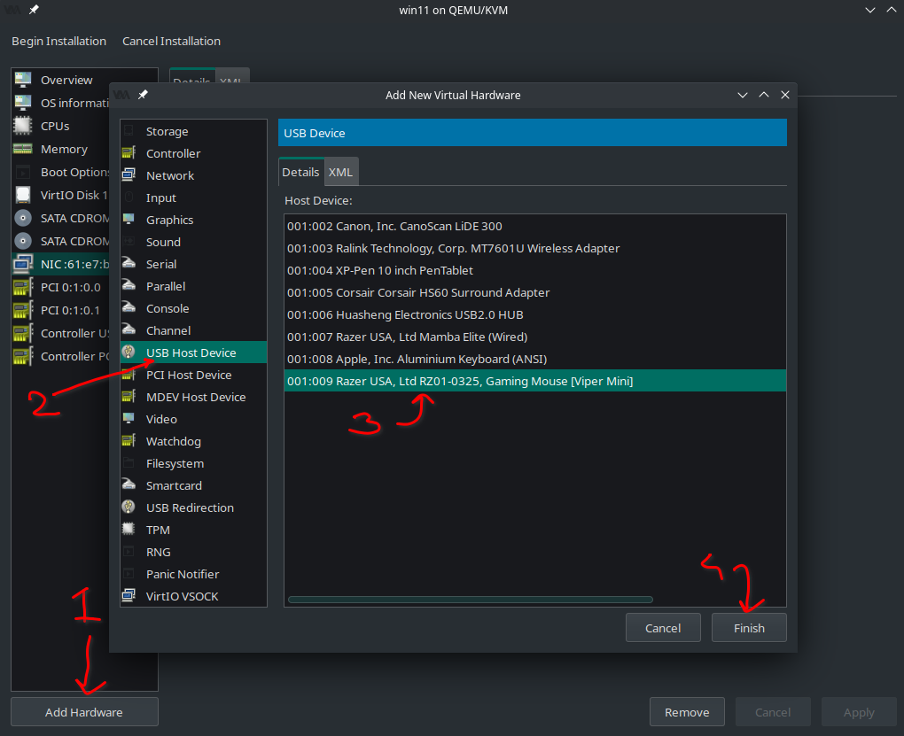
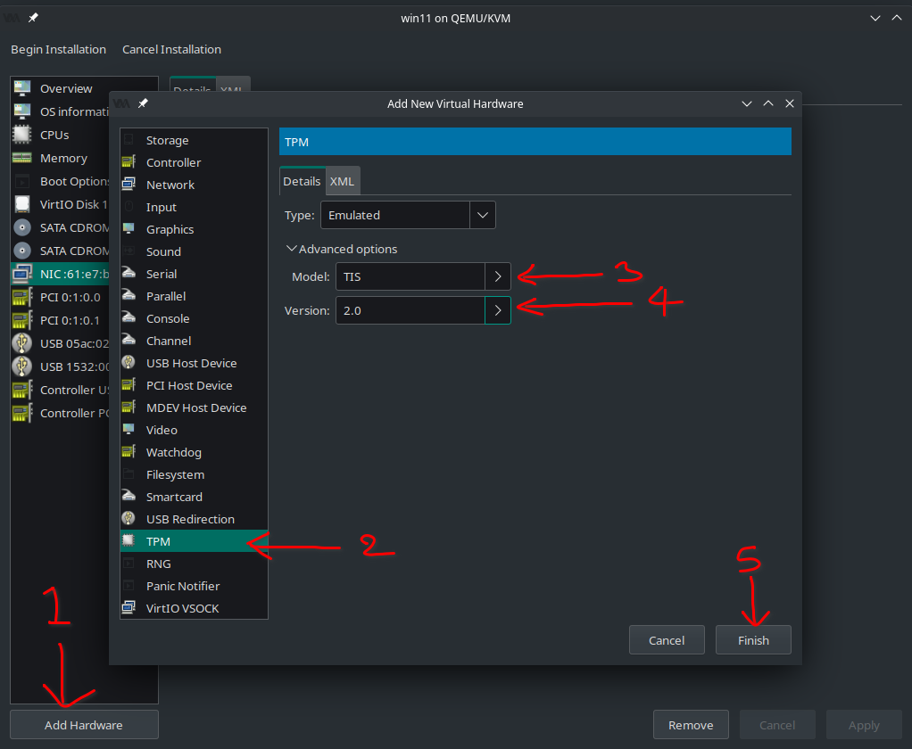

# Native Performant Virtual Machine
Setup a linux host machine to run virtual machines with near native performance. 

This repository describes the process of creating a **Windows 11** virtual machine on the Arch based distribution **Manjaro**. The following optimizations are used to achieve native performance:
* **Dynamic PCI-e passthrough** to bind/unbind GPU drivers
* **CPU core isolation** to limit host machine to a set of cores
* **CPU Pinning** to limit guest machine to a set of cores
* **CPU Frequency governor** to control CPU frequency on guest machine
* **Huge Memory Pages**
* **Virtio Disk** to optimize I/O operations
* **Keybinded Peripheral Swapping** to control both host and guest through a single set of peripherals
* **Audio passthrough** to get audio stream from guest in host machine

***

# Personal Hardware Configuration
For more detailed specifications check out log of [hwinfo --short](logs/pc-configuration.txt).
* **Motherboard**: Gigabyte Z370HD3 Rev 1.0
* **CPU**: Intel Core i5 8400
* **GPU**: Zotac GeForce RTX 3070
* **SSD**: Samsung 970 EVO 512GB

***

# Table of Contents
* [Introduction](#introduction)
* [Pre-requisites](#pre-requisites)
* [Install KVM and QEMU](#install-kvm-and-qemu)
* [Enable IOMMU](#enable-iommu)
* [Dynamic PCIe Binding](#dynamic-pcie-binding)
* [Creating Windows 11 Virtual Machine](#creating-windows-11-virtual-machine)
* [Performance Optimizations](#performance-optimizations)
* [References](#references)

***

# Introduction

***

# Pre-requisites

***

# Install KVM and QEMU
1. Open up a terminal and enter super user mode by typing `sudo -i`.
    > * This basically means that all the commands you'll be executing next will be as the super user.
    > * Many of the commands we'll enter next need to be executed as super user. Which could mean entering the password multiple times.
    > * This just makes things easier.
2. Install KVM packages
    ```bash
    $ pacman -Syyu archlinux-keyring \
    qemu virt-manager virt-viewer dnsmasq vde2 \
    bridge-utils openbsd-netcat ebtables iptables
    ```
3. Install libguestfs (A set of tools used to manage VMs): `pacman -S libguestfs`
4. Enable and start `libvirtd` services.
    ```bash
    $ systemctl enable libvirtd.service
    $ systemctl start libvirtd.service
    $ systemctl enable virtlogd.socket
    ```
    > * **systemctl** is used to manager services in manjaro. 
    > * **libvirtd** is a service for managing virtual machines. 
5. Edit `/etc/libvirt/libvirtd.conf`: `nano /etc/libvirt/libvirtd.conf`
    * **Uncomment line 85**: `unix_sock_group = "libvirt"`
    * **Uncomment line 108**: `unix_sock_rw_perms = "0770"`
6. Edit `/etc/libvirt/qemu.conf`: `nano /etc/libvirt/qemu.conf`
    * **Line 519**: Set `user` to your linux user name (run `echo $USER` to know what it is exactly).
    * **Line 523**: Set `group` to `libvirt`.
    > This is to avoid the disk reading issues that happens sometimes in virtual machine manager.
7. Add your user account to libvirt group by running
    ```bash
    $ usermod -a -G libvirt $(whoami)
    $ newgrp libvirt
    ``` 
8. Restart libvirt services
    ```bash
    $ systemctl restart libvirtd.service
    $ sudo systemctl restart libvirtd
    ```
9. Set network to autostart by default.
    ```bash
    $ virsh net-autostart default
    $ virsh net-start default
    ```

# Enable IOMMU
1. Open a terminal and execute `sudo nano /etc/default/grub`. 
    > * This will open up default GRUB configuration. 
    > * [GRUB](https://itsfoss.com/what-is-grub/) is a boot loader used by Manjaro Linux to load the operating system. We will edit this file to turn on IOMMU everytime the OS boots because it will be a pain to manually turn IOMMU on everytime.

2. Append `intel_iommu=on iommu=pt` to the end of **GRUB_CMDLINE_LINUX_DEFAULT** options. Afterwards it should look like this:
    ```bash
    # .. lines ...
    GRUB_CMDLINE_LINUX_DEFAULT="quiet udev.log_priority=3 intel_iommu=on iommu=pt"
    # .. lines ...
    ```

3. Save and exit file.

4. Update grub by typing `sudo update-grub`. 
    > This basically updates GRUB bootloader with the new configuration options.

5. Reboot.

6. Check if IOMMU has been enabled by executing `sudo dmesg | grep -i -e DMAR -e IOMMU`
    > * **[dmesg (diagnostic messages)](https://en.wikipedia.org/wiki/Dmesg)** is a command that prints the message buffer of the kernel
    > * **[grep](https://www.geeksforgeeks.org/grep-command-in-unixlinux/)** is used for string matching. **-i** is to ignore case and **-e** is to add a regex expression. In this command, we get the lines from **dmesg** that contains either **IOMMU** or **DMAR**.

    A line saying something like `DMAR: IOMMU enabled` should appear. [Check my log output here.](logs/dmesg-log.txt)

7. If IOMMU is turned on then check for IOMMU groups. Create a script with the contents of [group-ionmmu-hw.sh](scripts/group-iommu-hw.sh). Then execute it.
    > * This script gives you the IOMMU group each hardware in your system belongs to. We pass everything under the same IOMMU group to the guest machine.  
    > * The output will have multiple lines all following the format shown below:  
    >      * IOMMU Group **[GROUP NO]**: **[Bus Address]** Title [0600]: Short Description **[Hardware ID]** (rev **[Revision number]**)
    > * *If your GPU and audio driver are in a IOMMU group with something other than the PCIe driver, you need to do an ACS override Patch.

***

# Dynamic PCIe Binding
We are going to dynamically bind the **vfio drivers** before the VM starts and unbind these drivers after the VM terminates. To achieve this, we're going to use [libvirt hooks](https://libvirt.org/hooks.html). Libvirt has a hook system that allows you to run commands on startup or shutdown of a VM.

## Hooks Helper Script
1. Create a bash script with the contents of [qemu](scripts/qemu.sh)
2. Create a directory named `hooks` in `etc/libvirt` by executing `cd /etc/libvirt && sudo mkdir hooks`.
    > * **cd** is change directory. We go into `/etc/libvirt`.  
    > * **mkdir** is used to create a new directory.  
    > * **&&** is basically for chaining commands together.
    >
    > In short, we go to a directory and create a new folder there.
3. Copy this script into `/etc/libvirt/hooks/`. Make sure the name of the file is `qemu`.
4. Make the script executable by running `sudo chmod +x /etc/libvirt/hooks/qemu`.
    > * **chmod** command sets the permissions of files or directories.  
    > * **+x** is basically used to make the file executable by anyone.
5. Restart libvert services using `sudo systemctl restart libvirtd` to use the new script.
    > * It needs to be restarted so that it can use the new hook helper script.

## Hooks Directory Structure
Let's first get know the important hooks
```bash
# In directory:
# /etc/libvirt/hooks/qemu.d/

# Before a VM is started, before resources are allocated:
$vmname/prepare/begin/*

# Before a VM is started, after resources are allocated:
$vmname/start/begin/*

# After a VM has started up:
$vmname/started/begin/*

# After a VM has shut down, before releasing its resources:
$vmname/stopped/end/*

# After a VM has shut down, after resources are released:
$vmname/release/end/*
```
If we place **an executable script** in one of these directories, the **hook manager** will take care of everything else. Execute the following lines to setup the directory
```bash
$ cd /etc/libvirt/hooks 
$ sudo mkdir qemu.d && $ cd qemu.d
$ sudo mkdir win11 && cd win11
$ sudo mkdir prepare prepare/begin release release/end
```

Run `tree` on directory `/etc/libvirt/hooks` by typing `tree /etc/libvirt/hooks`. It should look like this
```
/etc/libvirt/hooks/
├── qemu
└── qemu.d
    └── win11
        ├── prepare
        │   └── begin
        └── release
            └── end
```
> * [Tree](https://www.tutorialspoint.com/unix_commands/tree.htm) is a recursive directory listing program
> * You might need to install tree using `sudo pacman -S tree`

## Setting up hooks
1. Create a file called `kvm.conf` in `/etc/libvirt/hooks` by executing `sudo touch /etc/libvirt/hooks/kvm.conf`.
2. We will now place the PCIe device ids inside this file in the following format
    ```
    ## Virsh devices
    VIRSH_GPU_VIDEO=pci_0000_01_00_0
    VIRSH_GPU_AUDIO=pci_0000_01_00_1
    VIRSH_GPU_USB=pci_0000_0a_00_2
    VIRSH_GPU_SERIAL=pci_0000_0a_00_3
    VIRSH_NVME_SSD=pci_0000_04_00_0
    ```
    > * Make sure to replace the bus addresses with the ones you want to actually pass through. You get these from the script used to generate IOMMU groups. 
    > * For example: `IOMMU Group 1 01:00.0 ...` converts to `VIRSH_...=pci_0000_01_00_0`
    > * I will not be passing my SSD through. And I won't be using the GPU USB option either.
3. Create the [bind_vfio.sh](scripts/pcie_dynamic_passthrough/bind.sh) script under `/etc/libvirt/hooks/qemu.d/win11/prepare/begin`. 
    > * [modprob](https://en.wikipedia.org/wiki/Modprobe) is used to 
    >   * add a loadable kernel module to the Linux kernel
    >   * remove a loadable kernel module from the kernel.
    > * `virsh nodedev-detach` basically detaches the PCI driver from host and attaches it to the guest machine which in this case is **win11**.
    > * **Remember to add addition `virsh nodedev-detach $PCI_NAME` for each PCI device you wish to passthrough**
4. Create the [unbind_vfio.sh](scripts/pcie_dynamic_passthrough/unbind.sh) script under `/etc/libvirt/hooks/qemu.d/win11/release/end`.
    > * `modprob -r` is basically used to remove loadable kernel module from the kernel.
    > * `virsh nodedev-reattach` basically detaches the drivers from the guest and reattaches them to the host.
    > * As before add additional `virsh nodedev-reattach` lines for each PCI device.
5. Make these two scripts executable by running `chmod +x` on them.
6. After creating the scripts the tree structure for `/etc/libvirt/hooks/` should look like this
    ```
    /etc/libvirt/hooks/
    ├── kvm.conf
    ├── qemu
    └── qemu.d
        └── win10
            ├── prepare
            │   └── begin
            │       └── bind_vfio.sh
            └── release
                └── end
                    └── unbind_vfio.sh
    ```

We're done setting up the hooks for PCI passthrough.

***

# Creating Windows 11 Virtual Machine

## Downloading Necessary Files
1. Download a windows 11 iso from the official microsoft site.
2. Download the stable release of virtio iso from [here](https://docs.fedoraproject.org/en-US/quick-docs/creating-windows-virtual-machines-using-virtio-drivers/).
    > We'll be using virtio drivers for storage and network. virtio is optimized for virtual machines.
3. Install TPM emulator `sudo pacman -Syyu swtpm`.
    > **TPM or Trusted Platform Module** is a hardware chip required to use Windows 11. We're basically emulating a hardware chip using this software package. 

## Creating the Virtual Machine
Before starting to create a new Virtual Machine enable `XML editting` in `Preferences` under `Edit`. We'll need to edit the XML for many optimizations.
1. Create a virtual machine following `Virtual Machine Manager`
    > * How to install OS: Local Install Media
    > * Choose ISO: Windows 11 iso downloaded in step 1.
    > * Memory: I set 16384MB.
    > * CPU: I set 4
    > * Storage: I created a custom 64GB qcow2 storage.
    > * Virtual machine name: Must be **win11**
    > * Tick configure before installation.
2. In **Overview**, set firmware to secure boot.<br>
    > Windows 11 requires secure boot to work.
3. Go to **CPU** and set options.<br>
    > * Socket: Number of CPUs attached. In my case only 1.
    > * Cores: I set 4. Meaning, I'll have one CPU with 4 cores.
    > * Threads: I set 1. Meaning, Each core will have one thread.
4. Go to **SATA disk 1** and set options.<br>
    > * Virtio disks are much more optimized for VMs compared to SATA.
    > * The cache mode `write-back` is a minor optmization to speed up disk speeds.
5. Go to **NIC** and set options.<br>
6. Remove everything else except for the followings in the scrren shot.<br>
7. Add new hardware.<br>
    > We're loading the virtio iso downloaded in step 2.
8. Go to **boot options** and configure CD ROM1 to boot first and then the virtio disk.<br>
9. Add PCI hardware using `Add Hardware`. Each individual hardware must be added seperately.<br>
    > **Make sure to repeat this step for all the devices associated with your GPU in the same IOMMU group**
10. Add USB devices to passthrough using `Add New Hardware`.<br>
    > **The USB devices passed through will NOT be available on the host at this point.** Have additional mouse and keyboards attached so that you can use the host machine.
11. Add TPM through `Add New Hardware`.<br>

## (Optional) Workaround for nVidia GPUs
If you're using an nVidia GPU then you might face [Issue 43](https://passthroughpo.st/apply-error-43-workaround/). If you want to use all its features on the VM, you need to hide that the guest machine is a VM. To solve this we need to edit the VM XML.

1. Add vendor id for KVM hypervisor.
```xml
<features>
    ...
    <hyperv>
        ...
        <spinlocks state="on" retries="8191"/>
        <vendor_id state="on" value="kvm hyperv"/>  <!-- Add this line -->
    </hyperv>
    ...
</features>
```
2. In addition, instruct kvm to hide its state by adding the following code directly below the `<hyperv>` section:
    ```xml
    <features>
        ...
        <hyperv>
            ...
        </hyperv>
        <!-- Add this portion -->
        <kvm> 
            <hidden state="on"/>
        </kvm>
        ...
    </features>
    ```
3. Finally, append the following line to `<feature>`
    ```xml
    <feature>
        ...
        <ioapic driver="kvm"/> <!-- Add this line -->
    </features>
    ```

We're done setting up the virtual machine and can now begin installation.

***

# Performance Optimizations

## CPU Pinning
This step limits the guest machine to a select few cores of a CPU. This way the guest won't touch the other cores leaving them free for the host machine. 

1. Run `lscpu -e`. This will show you the topology of your CPU. Check my logs [here](logs/lscpu.txt).
2. You want to pin cores that share the same L3 cache value. I will pin cores 0 to 3.
3. Add CPU pinning info to the VM XML.
    ```xml
    <vcpu placement='static'>4</vcpu>
    <!-- Insert the portion below -->
    <cputune>
        <vcpupin vcpu='0' cpuset='0'/>
        <vcpupin vcpu='1' cpuset='1'/>
        <vcpupin vcpu='2' cpuset='2'/>
        <vcpupin vcpu='3' cpuset='3'/>
    </cputune>
    ```
4. Edit `<cpu>` to include the lines mentioned below:

    ```xml
    <cpu mode="host-passthrough" check="none" migratable="on">
        <topology sockets="1" dies="1" cores="4" threads="1"/>
        <!-- Insert the portion below -->
        <cache mode="passthrough"/>
        <feature policy="require" name="topoext"/>
    </cpu>
    ```

## CPU Isolation
This step ensures that when the guest machine is running the host machine won't use the cores being used by the guest machine. We'll achieve this by using hooks.

1. Create [bind_cpu.sh](scripts/cpu_dynamic_isolation/bind_cpu.sh) and place under `/etc/libvirt/hooks/qemu.d/win11/prepare/begin`.
2. Create [unbind_cpu.sh](scripts/cpu_dynamic_isolation/unbind_cpu.sh) and place under `/etc/libvirt/hooks/qemu.d/win11/release/end`.
3. Make sure all scripts are executable by running `chmod +x` on them.

## CPU Governor
This performance tweak14 takes advantage of the CPU frequency scaling governor in Linux.

1. Create [cpu_performance_mode.sh](scripts/cpu_governor_mode/cpu_performance_mode.sh) and place under `/etc/libvirt/hooks/qemu.d/win11/prepare/begin`.
2. Create [cpu_ondemand_mode.sh](scripts/cpu_governor_mode/cpu_ondemand_mode.sh) and place under `/etc/libvirt/hooks/qemu.d/win11/release/end`.
3. Make sure all scripts are executable by running `chmod +x` on them.

After adding all required files the directory should look like this
```
/etc/libvirt/hooks/
├── kvm.conf
├── qemu
└── qemu.d
    └── win11
        ├── prepare
        │   └── begin
        │       ├── bind_cpu.sh
        │       ├── bind_vfio.sh
        │       └── cpu_performance_mode.sh
        └── release
            └── end
                ├── cpu_ondemand_mode.sh
                ├── unbind_cpu.sh
                └── unbind_vfio.sh

6 directories, 8 files
```

## Huge Pages
Manjaro handles this by default. So no need to manually set this up.

## HyperV Tweaks

Edit your VM XML to include the following tags: 

```xml
<features>
    ...
    <hyperv>
      <relaxed state="on"/>
      <vapic state="on"/>
      <spinlocks state="on" retries="8191"/>
      <vendor_id state="on" value="kvm hyperv"/>
      <!-- Append elements from below -->
      <vpindex state='on'/>
      <synic state='on'/>
      <stimer state='on'/>
      <reset state='on'/>
      <frequencies state='on'/>
    </hyperv>
    ...
</features>
```

More information about these tweaks can be found [here](https://mathiashueber.com/performance-tweaks-gaming-on-virtual-machines/).

# References
* [PCI Passthrough via OVMF](https://wiki.archlinux.org/title/PCI_passthrough_via_OVMF)
* [GPU Passthrough Tutorial](https://github.com/bryansteiner/gpu-passthrough-tutorial#part2)